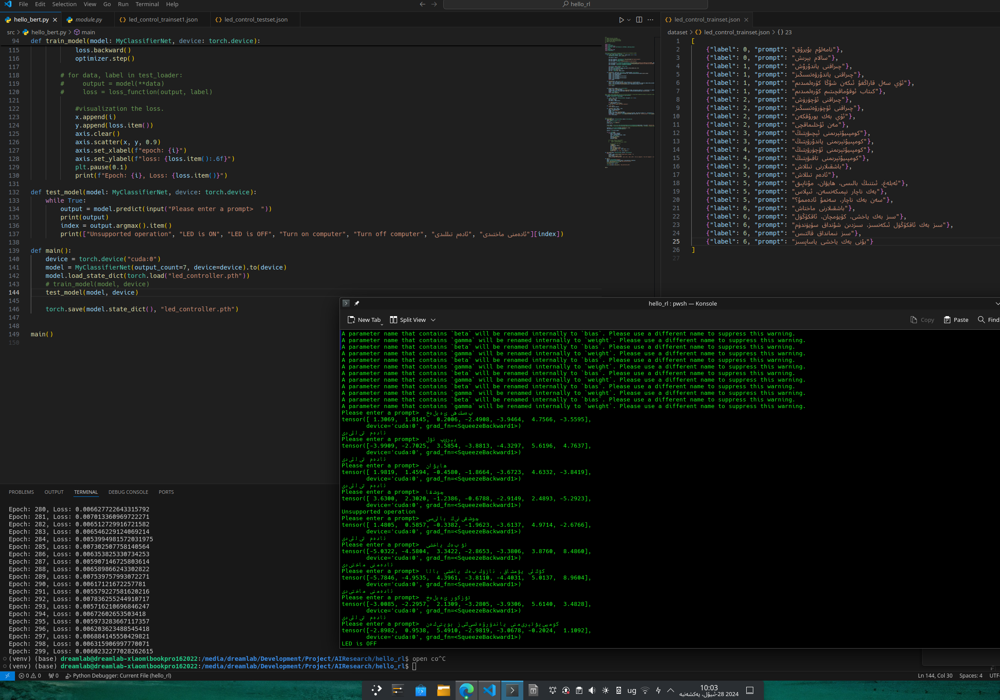

# What is it?

A text classification model for 200 languages using Meta-AI nllb200 and Google BERT model.

### how to run this example?

1. install torch and huggingface transformers library through `pip3 install torch huggingface`
2. download BERT base mode and nllb200 600m model through the following two command: `huggingface-cli download facebook/nllb-200-distilled-600M` `huggingface-cli download google-bert/bert-base-uncased`
3. train model through `python3 hello_bert.py`
4. comment and/or uncomment the function callings in `hello_bert.py` to test the model

```
def main():
    device = torch.device("cuda:0")
    model = MyClassifierNet(output_count=7, device=device).to(device)
    model.load_state_dict(torch.load("led_controller.pth"))
    #train_model(model, device)
    test_model(model, device)
    
    torch.save(model.state_dict(), "led_controller.pth")
```

### Screenshots:


